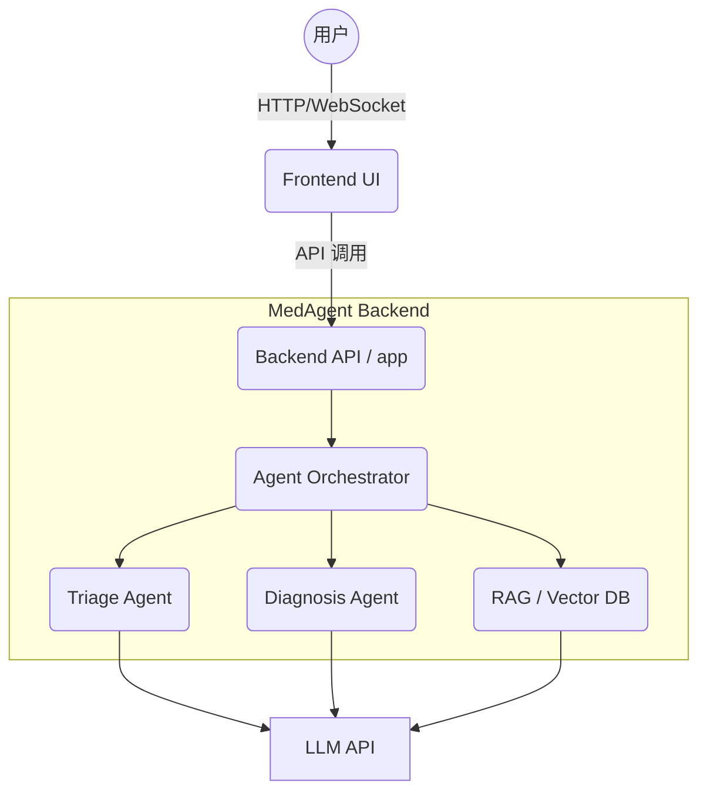
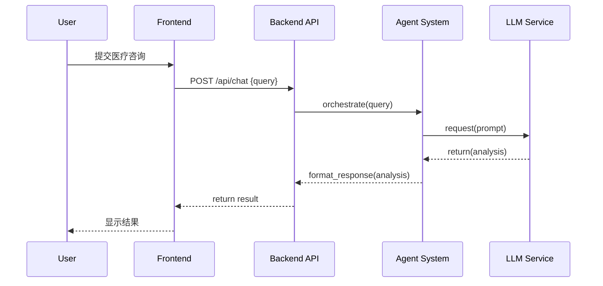

# 整体项目架构分析报告 (MedAgent)

## 一、整体项目分析

1. **项目目标是什么？**  
   本项目旨在提供一个基于大型语言模型 (LLM) 和多智能体 (Multi-Agent) 协同机制的医疗辅助分析与问答平台，提升医疗咨询和数据分析的智能化与自动化程度。

2. **这个项目解决了什么问题？**  
   解决了传统医疗辅助系统智能化不足的问题，通过多 Agent 协同（例如诊断、分诊、信息检索等职责）提升了医疗问答的准确性和效率，同时提供现代化的前后端交互体验。

3. **项目的整体架构模式是什么？**  
   本项目采用**前后端分离**架构，并且在后端采用了**分层架构 (Layered Architecture)**，结合了基于 Agent 的智能体编排模式。应用整体以 Docker 容器化形式部署，支持微服务化演进。

4. **项目技术栈说明**  
   - **语言**: Python (99.2%) 作为核心后端与 AI 逻辑驱动，Dockerfile (0.8%) 用于容器化。
   - **框架**: FastApi/Flask (推测应用层), LLM 框架 (如 LangChain 或自定义 Agent 编排框架)。
   - **前端**: 可能采用 React/Vue 等现代前端框架 (位于 `frontend` 目录)。
   - **部署**: Docker, Docker Compose。

5. **核心设计思想**  
   模块化、智能体协同 (Multi-Agent Collaboration)、高扩展性与容器化部署。

---

## 二、目录结构解析

```text
MedAgent/
├── app/                  # 后端核心业务逻辑与 Agent 编排
│   ├── api/              # API 路由与控制器
│   ├── core/             # 核心配置与中间件
│   ├── agents/           # 多智能体核心逻辑 (如诊断Agent, 检索Agent)
│   ├── models/           # 数据模型 (Pydantic/ORM)
│   └── services/         # 业务服务层
├── frontend/             # 前端 UI 代码
├── tests/                # 单元测试与集成测试代码
├── Dockerfile            # 后端应用容器构建脚本
├── docker-compose.yml    # 多容器服务编排 (前后端、数据库等)
├── requirements.txt      # Python 依赖清单
└── .env.example          # 环境变量示例
```

- **app/**: 承载核心业务，依赖于大模型 API 服务，负责处理 API 请求和 Agent 调度。
- **frontend/**: 负责用户交互界面的渲染，通过 REST/WebSocket 与后端通信。
- **docker-compose.yml**: 串联前后端服务的依赖，方便一键启动测试或部署。

---

## 三、核心模块详细说明

### 1. Agents 模块 (`app/agents/`)
- **模块职责**: 负责定义、初始化和调度不同的医疗 AI Agent。
- **对外暴露接口**: `run_agent_pipeline(query: str, context: dict)`
- **内部关键类/函数**: `BaseAgent`, `DiagnosisAgent`, `RetrievalAgent`
- **调用流程**: 收到外部请求 -> 分发给对应的 Agent -> Agent 内部调用 LLM API -> 聚合结果返回。
- **数据流向**: User Query -> Agent Router -> LLM -> Formatted Response。
- **耦合问题**: Agent 之间的状态共享依赖 Context，若直接修改会导致隐性耦合，推荐使用消息总线或状态机。
- **SOLID 原则**: 基本符合单一职责原则 (SRP) 和开闭原则 (OCP)，通过继承 `BaseAgent` 实现扩展。

---

## 四、核心类 / 函数解析

### `AgentOrchestrator` (推测核心类)
- **功能说明**: 协调多个智能体的工作流。
- **参数说明**: `query` (用户输入的自然语言), `session_id` (会话上下文ID)。
- **返回值说明**: `AgentResponse` (包含生成的文本和参考引用)。
- **调用关系**: 被 API Router 调用，向下调用各个具体的 Agent。
- **性能风险**: 串行调用多个 LLM 可能导致高延迟，建议引入异步并发。
- **可优化点**: 引入缓存机制 (如 Redis) 存储相同的诊断查询结果。

---

## 五、项目运行流程

1. **程序启动流程**  
   启动 Docker Compose -> 初始化数据库及依赖 -> 启动后端服务 (加载 Agent 和模型配置) -> 启动前端静态服务器。
2. **关键请求的执行流程**  
   用户前端输入医疗咨询问题 -> 发送 HTTP 请求到后端 `/api/chat` -> 后端鉴权 -> 转发给 Agent 协调器处理 -> 返回结果推流给前端。
3. **数据处理流程**  
   接收到数据进行脱敏 -> 提取症状关键字 -> 向量数据库检索/LLM 增强生成 (RAG) -> 构建响应结构。
4. **异常处理机制**  
   全局 Exception Handler 捕获网络、LLM 速率限制等异常，并返回标准 JSON 错误格式。
5. **日志体系**  
   使用 Python logging 模块，记录入参出参、Agent 决策链路与 LLM 消耗 Token 数。

---

## 六、架构评估

- **架构优点**: 
  1. 职能分明，前后端分离。
  2. Agent 架构适应未来 AI 应用的演进。
  3. 容器化方案易于横向扩展。
- **架构缺点**: 多 Agent 交互时存在通信开销和状态管理复杂的隐患。
- **技术债**: 测试覆盖率若不足，随着 Agent 类型增加将难以维护。
- **可扩展性分析**: 优秀，可以通过注册新 Agent 轻松扩展新功能。
- **重构建议**: 引入任务队列（如 Celery）解耦长时间的 Agent 推理任务。
- **性能优化建议**: 对大模型接口响应使用 Streaming 流式输出，优化前端用户体验 (TTFT)。

---

## 七、架构图表

### 1. 整体架构图



### 2. 核心调用流程图


